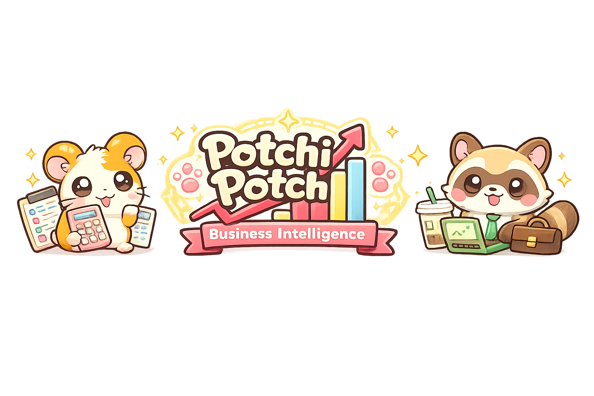
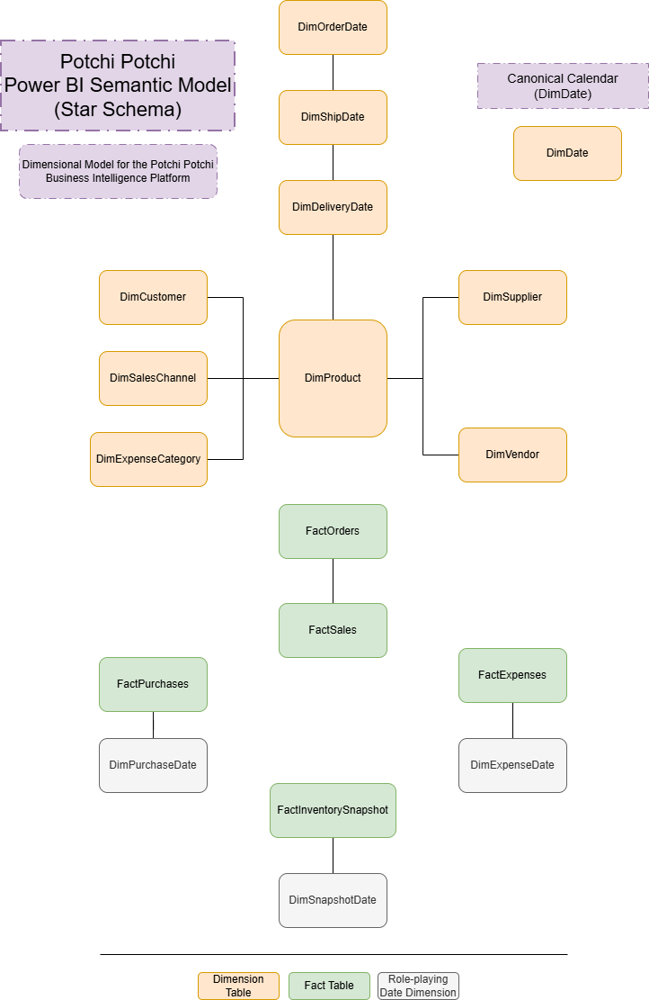

# Potchi Potchi Business Intelligence

> **An end-to-end Business Intelligence case study covering market research, business analysis, dimensional modelling, synthetic dataset generation, Power BI development and executive reporting.**



---

# Project Overview

Potchi Potchi Business Intelligence is an end-to-end Business Intelligence portfolio project that simulates the complete analytical lifecycle of a fictional UK-based designer collectibles retailer.

Rather than focusing solely on dashboard development, the project demonstrates how a Business Intelligence initiative would be conducted in a real organisation, from understanding business requirements to transforming raw transactional data into actionable business insights.

The solution includes every major stage of a BI project, including:

- Market Research
- Business Requirements Analysis
- Data Requirements Definition
- Dimensional Data Modelling
- Synthetic Dataset Design
- Power BI Data Modelling
- DAX Development
- Executive Dashboard Design
- Business Insights & Strategic Recommendations

---

# Company Profile

**Potchi Potchi** is a fictional UK-based online retailer specialising in designer collectibles, blind boxes and art toys from leading Asian brands.

The business begins operations with an initial investment of **£20,000**, operating from a home-based inventory before gradually expanding into dedicated storage facilities as demand increases.

Its long-term vision is to become a trusted destination for collectors across the United Kingdom and Europe while generating sufficient capital to support future international expansion.

---

# Business Question

This project was designed to answer one strategic business question:

> **Can Potchi Potchi become a profitable UK-based designer collectibles retailer capable of supporting future international expansion?**

To answer this question, the project analyses two years of simulated operational data covering sales, customers, inventory and financial performance.

---

# Project Outcome

Based on the dashboard analyses, Potchi Potchi demonstrates consistent business growth throughout its first two years of operation.

The data indicates:

- 📈 Consistent revenue growth
- 💰 Healthy gross and net profit margins
- ❤️ Strong customer retention
- 📦 Sustainable inventory turnover
- 📊 Controlled operating expenses

The Business Intelligence solution suggests that the company has developed a financially sustainable business model capable of supporting **gradual expansion into nearby European markets**.

However, the available data does **not** yet provide sufficient evidence to recommend immediate expansion into Brazil.

Such a strategic decision would require additional market research, financial modelling, operational planning and country-specific analyses.

---

# Key Achievements

- Designed a complete end-to-end Business Intelligence solution from market research to executive reporting.
- Built a dimensional star schema supporting five analytical dashboards.
- Developed business KPIs and DAX measures covering Sales, Customers, Inventory and Finance.
- Generated a synthetic retail dataset simulating two years of business operations.
- Produced comprehensive business and technical documentation following industry best practices.

---

# Dashboard Highlights

The Power BI solution is organised into five analytical dashboards, each supporting a different business area.

## Executive Overview


Provides a high-level summary of business performance through executive KPIs and revenue trends.

**Highlights**

- Revenue
- Gross Profit
- Orders
- Customers
- Units Sold
- Average Order Value
- Revenue Trend
- Revenue by Brand
- Revenue by Collection
- Revenue by Sales Channel

---

## Sales Analysis


Evaluates pricing strategy, commercial performance and sales profitability.

**Highlights**

- Gross Margin
- Discount Rate
- Month-over-Month Growth
- Platform Fee
- Average Items per Order
- Monthly Sales Performance
- Gross Profit by Collection
- Average Discount by Brand
- Sales Mix by Product Type

---

## Customer Analysis


Explores customer acquisition, purchasing behaviour and demographic segmentation.

**Highlights**

- Repeat Rate
- Purchase Frequency
- Average Customer Value
- Loyalty Member Rate
- Marketing Opt-In Rate
- Customer Acquisition Trend
- Revenue by Age Group
- Preferred Sales Channel
- Customer Distribution by Generation

---

## Inventory


Monitors inventory availability, stock health and product distribution.

**Highlights**

- Inventory Value
- Current Stock Units
- Low Stock Products
- Stockout Rate
- Inventory Turnover
- Inventory Value Trend
- Inventory Mix
- Top Inventory Products
- Low Stock Products by Brand

---

## Finance


Summarises operational expenses and overall financial performance.

**Highlights**

- Operating Expenses
- Marketing Spend
- Platform Fees
- Net Profit
- Net Profit Margin
- Operating Expenses Trend
- Expense Breakdown
- Profit Bridge
- Operating Expenses vs Net Profit

---

## Project Development Lifecycle

The project follows a structured Business Intelligence lifecycle inspired by real-world consulting and analytics projects.

```text
Market Research
      ↓
Business Requirements
      ↓
Data Requirements
      ↓
Dimensional Data Model
      ↓
Business Financial Assumptions
      ↓
Dataset Design
      ↓
Data Dictionary
      ↓
Dataset Creation
      ↓
Power Query
      ↓
Power BI Semantic Model
      ↓
DAX
      ↓
Dashboard Development
      ↓
Executive Presentation
```

---

# Project Scope

This project covers the complete Business Intelligence lifecycle, including:

- Market Research
- Business Requirements Analysis
- Data Requirements Definition
- Dimensional Data Modelling
- Dataset Design
- Power Query (ETL)
- Power BI Data Model
- DAX Measures
- Interactive Dashboard Development
- Executive Business Presentation

---

# Technology Stack

| Tool | Purpose |
|------|---------|
| Power BI | Dashboard Development |
| Power Query | Data Transformation (ETL) |
| DAX | Business Calculations |
| Microsoft Excel | Dataset Creation |
| Visual Studio Code | Documentation |
| Git | Version Control |
| GitHub | Project Management & Portfolio |

---

# Repository Structure

```text
potchi-potchi-business-intelligence
│
├── README.md
├──requirements.text
├──LICENSE.text
│
├── assets/
│   ├── icons/
│   ├── images/
│   ├── logo/
│   └── screenshots/
│
├── docs/
│   ├──business/
│      ├── 00-document-template
│      ├── 01-market-research.md
│      ├── 02-business-requirements-document.md
│      ├── 03-data-requirements-document.md
│      ├── 04-dimensional-data-model.md
│      └── 05-business-final-assumptions.md
│   ├── technical/
│       ├── dashboard/
│           └── 09-business-insights-report.md
│       ├── data-model/
│           ├── 06-dataset-design-specification.md
│           ├── 07-data-dictionary.md
│           └── 08-power-bi-model.md
│       ├── dax/
│           └── 11-dax-documentation.md
│       └── power-query/
│           └── 10-power-query-transformations.md
│
├── data/
│   ├── raw/
│       ├── DimCustomer.csv
│       ├── DimDate.csv
│       ├── DimExpenseCategory.csv
│       ├── DimProduct.csv
│       ├── DimSalesChannel.csv
│       ├── DimSupplier.csv
│       ├── DimVendor.csv
│       ├── FactExpenses.csv
│       ├── FactInventorySnapshot.csv
│       ├── FactOrders.csv
│       ├── FactPurchases.csv
│       └── FactSales.csv
│   ├── processed/
│   ├── reference/
│       └── master_product_catalog.csv
│   └── sample/
│
├── powerbi/
│   └── PotchiPotchi_BI.pbix
│
├── project-management/
│   ├── diagrams/
│       └── powerbi-semantic-model.drawio
└── scripts/
│   ├── __pycache__/
│   ├── generators/
│       ├── __pycache__/
│       ├── __init__.py
│       ├── dimensions.py
│       └── facts.py
│   ├── reference/
│       ├── __pycache__/
│       ├── brands/
│           ├── __pycache__/
│           ├── __init__.py
│           ├── baby_three.py
│           ├── jellycat.py
│           ├── lucky_emma.py
│           ├── mofusand.py
│           ├── nommi.py
│           ├── popmart.py
│           ├── rolife_nanci.py
│           └── sanrio.py
│       ├── __init__.py
│       ├── build_master_catalog.py
│       └── catalog.py
├── __init__.py
├── config.py
├── generate_synthetic_data.py
└── validation.py
```

---

# Assets

This folder contains visual assets used throughout the Potchi Potchi Business Intelligence project.

## Image Attribution

Some illustrations, mascots, icons and decorative elements were generated with the assistance of generative AI and subsequently selected, curated and integrated into the dashboard design.

These assets are used exclusively for educational and portfolio purposes.

---

# Semantic Model

The Potchi Potchi data warehouse follows a dimensional modelling approach based on a star schema.

The model is composed of:

| Component | Quantity |
|-----------|---------:|
| Dimension Tables | 7 |
| Role-playing Date Dimensions | 6 |
| Fact Tables | 5 |
| Canonical Calendar | 1 |

### Power BI Semantic Model



---

# Project Roadmap

| Phase | Status |
|--------|--------|
| ✅ Market Research | Completed |
| ✅ Business Requirements Document | Completed |
| ✅ Data Requirements Document | Completed |
| ✅ Dimensional Data Model | Completed |
| ✅ Business Financial Assumptions | Completed |
| ✅ Dataset Design Specification | Completed |
| ✅ Data Dictionary | Completed |
| ✅ Dataset Creation | Completed|
| ✅ Power Query | Completed |
| ✅ Power BI Data Model | Completed |
| ✅ DAX Measures | Completed |
| ✅ Dashboard Development | Completed |
| ✅ Business Insights Report | Completed |
| ✅ Strategic Business Assessment | Completed |

---
 
# Documentation

## Business Documentation

| Document | Version | Status | Description |
|----------|---------|--------|-------------|
| 01 - Market Research | v0.1.0 | ✅ Completed | Analyses the UK collectibles market, competitors, customer trends and business viability. |
| 02 - Business Requirements Document (BRD) | v0.1.0 | ✅ Completed | Defines the business objectives, scope, stakeholders and functional requirements for the project. |
| 03 - Data Requirements Document (DRD) | v0.4.0 | ✅ Completed | Identifies the datasets, data sources, quality requirements and business questions the solution must answer. |
| 04 - Dimensional Data Model | v0.4.0 | ✅ Completed | Documents the analytical data model, including fact tables, dimensions, relationships and modelling decisions. |
| 05 - Business Financial Assumptions | v0.1.3 | ✅ Completed | Defines the financial assumptions that drive the business simulation, including investment, operating costs, growth and expansion scenarios. |

## Technical Documentation

| Document | Version | Status | Description |
|----------|---------|--------|-------------|
| 06 - Dataset Design Specification | v0.5.0 | ✅ Completed | Defines the structure, purpose, expected volume and technical design of each dataset before implementation. |
| 07 - Data Dictionary | v0.2.0 | ✅ Completed | Documents every field, data type, business definition and validation rule used throughout the project. |
| 08 - Power BI Model | v0.1.0 | ✅ Completed |  |
| 09 - Business Insights Report | v0.2.0 | ✅ Completed | Presents the executive analysis of all Power BI dashboards, including key findings, business insights, strategic recommendations and the final assessment of the project's business question.
| 10 - Power Query Transformations | v0.1.0 | ✅ Completed | Documents the ETL workflow, data preparation steps, transformation logic and validation processes implemented in Power Query before loading data into the Power BI semantic model. |
| 11 - DAX Documentation | v0.1.0 | ✅ Completed | Documents calculated columns, measures and business logic implemented using DAX. |

---

# Dashboard Preview

See Dashboard Highlights above.

---

# Future Improvements

Potential future enhancements include:

- Customer Segmentation
- Marketing Campaign Analysis
- Predictive Sales Forecasting
- Inventory Forecasting
- Supplier Performance Dashboard
- Brazil Expansion Scenario Analysis
- Financial Forecasting
- Community Swap Club
- Collector Profiles
- Wishlist & Collection Tracker
- Product Availability Alerts
- Storage Capacity Utilisation

---

# Learning Objectives

This project was developed to simulate the complete lifecycle of a Business Intelligence initiative, from business discovery and market research to data modelling, dashboard development and executive recommendations.

Rather than focusing exclusively on Power BI, the objective is to demonstrate business analysis, stakeholder thinking, dimensional modelling, KPI design and data-driven decision-making using a realistic e-commerce case study.

---

# Visual Assets

The Potchi Potchi visual identity was created exclusively for this portfolio project.

This includes:

- Project logo
- Mascots
- Banner artwork
- Dashboard illustrations
- Decorative UI elements

Visual assets were generated using OpenAI image generation tools and curated, refined and integrated into the project by the author.

They are included solely for educational and portfolio purposes and are not intended for commercial use.

---

# Disclaimer

Potchi Potchi is a fictional company created exclusively for educational and portfolio purposes.

All business scenarios, financial data, customers, products and dashboards were designed to simulate realistic Business Intelligence workflows and should not be interpreted as real commercial data.

---

# About the Author

**Alyssa da Silva Ribeiro**

Business Intelligence | Data Analytics | Trust & Safety | Localisation

---

# License

This project is licensed under the MIT License.

