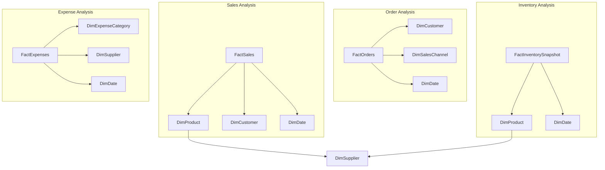
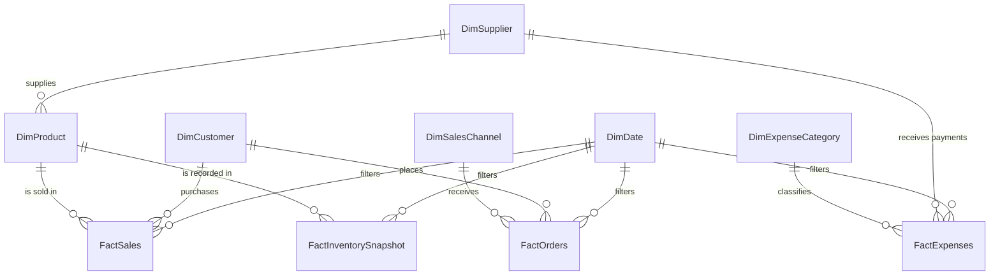

# 04. Dimensional Data Model

**Project:** Potchi Potchi Business Intelligence  
**Document:** Dimensional Data Model  
**Version:** v0.1.0  
**Author:** Alyssa da Silva Ribeiro  
**Last Updated:** 13 July 2026  
**Status:** Draft

---

# Table of Contents

1. Purpose
2. Modelling Approach
3. Architecture Diagrams
4. Business Objectives
5. Fact Tables
6. Dimension Tables
7. Relationship Model
8. Cardinality
9. Filter Direction
10. Design Decisions
11. Future Improvements
12. Appendix

---

# 1. Purpose

This document defines the dimensional model that will support the Potchi Potchi Business Intelligence solution.

The model has been designed following dimensional modelling best practices to maximise reporting performance, simplify business analysis and provide a scalable architecture for future business growth.

---

# 2. Modelling Approach

Potchi Potchi adopts a **Fact Constellation Schema (Galaxy Schema)** composed of multiple fact tables that share common dimensions.

This architecture was selected because the business contains multiple independent business processes, including:

- Sales
- Orders
- Inventory
- Operating Expenses

Separating these processes into individual fact tables preserves the correct level of granularity while avoiding duplicated information.

---

# 3. Architecture Diagrams

The following diagrams present the Potchi Potchi dimensional model at two different levels of detail.

The high-level diagram provides a business-friendly overview of the analytical areas covered by the solution. The technical entity-relationship diagram documents the relationships and cardinalities that will be implemented within the Power BI semantic model.

---

## 3.1 High-Level Architecture

This diagram provides a simplified view of the four business processes represented within the model and the dimensions used to analyse them.



### Business Interpretation

The model separates four distinct business processes:

- **Sales Analysis** measures revenue, units sold, cost and gross profit at product-line level.
- **Order Analysis** measures order-level activity, including order count, shipping and discounts.
- **Inventory Analysis** records historical stock positions through monthly inventory snapshots.
- **Expense Analysis** records operating costs and supports net-profit and cash-flow analysis.

Shared dimensions allow the same products, customers, suppliers and dates to be analysed consistently across multiple business processes.

---

## 3.2 Technical Entity-Relationship Diagram

The following entity-relationship diagram documents the primary one-to-many relationships within the dimensional model.



### Relationship Conventions

- `||` represents exactly one record on the dimension side.
- `o{` represents zero or many records on the related fact or child side.
- Dimension tables filter fact tables using one-to-many relationships.
- Filter direction will flow from dimensions to facts.
- Fact tables will not directly filter one another.

---

# 4. Business Objectives

The dimensional model has been designed to answer the following business questions:

- Is the business profitable?
- Which products generate the highest revenue?
- Which brands perform best?
- Which collections are growing?
- Which suppliers contribute the most revenue?
- Which products require replenishment?
- How much inventory is currently held?
- What are the main operating costs?
- When should warehouse capacity be expanded?
- When is expansion into Brazil financially viable?

---

# 5. Fact Tables

Fact tables store measurable business events.

---

## FactSales

### Business Process

Product sales.

### Granularity

**One row per product sold within an order.**

### Measures

- Quantity Sold
- Unit Price
- Unit Cost
- Sales Amount
- Cost Amount
- Gross Profit
- Discount Amount

### Foreign Keys

- DateKey
- CustomerKey
- ProductKey

### Degenerate Dimension

- OrderID

`OrderID` will be stored directly within FactSales as a degenerate dimension. It preserves the ability to identify and count individual orders without creating a direct relationship between FactSales and FactOrders.

---

## FactOrders

### Business Process

Customer orders.

### Granularity

**One row per completed order.**

### Measures

- Shipping Cost
- Order Discount
- Number of Orders

### Foreign Keys

- DateKey
- CustomerKey
- SalesChannelKey

---

## FactInventorySnapshot

### Business Process

Inventory monitoring.

### Granularity

**One row per product per monthly inventory snapshot.**

Monthly snapshots preserve historical inventory levels while keeping the dataset compact and suitable for analytical reporting.

### Measures

- Current Stock
- Inventory Value
- Units on Order
- Reorder Point
- Safety Stock

### Foreign Keys

- DateKey
- ProductKey

---

## FactExpenses

### Business Process

Operating expenses.

### Granularity

**One row per expense transaction.**

### Measures

- Expense Amount

### Foreign Keys

- DateKey
- ExpenseCategoryKey
- SupplierKey

---

# 6. Dimension Tables

Dimension tables describe business entities used to filter and categorise facts.

---

## DimDate

Stores calendar information used for time intelligence calculations.

### Granularity

One row per calendar date.

---

## DimCustomer

Stores customer information.

### Granularity

One row per customer.

---

## DimProduct

Stores product information.

### Granularity

One row per product.

The table contains product attributes including:

- Brand
- Collection
- Character
- Category
- Current Retail Price
- Current Cost Price
- SupplierID

Supplier information is maintained through the Supplier dimension to reduce redundancy and support supplier-level analysis.

---

## DimSupplier

Stores supplier information.

### Granularity

One row per supplier.

The dimension supports future analysis including:

- Supplier performance
- Lead time
- Country of origin
- Supplier dependency
- Procurement analysis

---

## DimSalesChannel

Stores customer purchasing channels.

### Examples

- Website
- Instagram
- TikTok Shop
- Marketplace
- Collector Event

---

## DimExpenseCategory

Stores expense classifications.

### Examples

- Inventory Purchase
- Storage
- Marketing
- Packaging
- Website
- Software
- Accounting

---

# 7. Relationship Model

The dimensional model follows a primarily Star Schema architecture with a controlled Snowflake relationship between Products and Suppliers.

```
FactSales
     │
     ▼
DimProduct
     │
     ▼
DimSupplier
```

Overall model:

```
                           DimDate
                              │
      ┌───────────────────────┼────────────────────────┐
      │                       │                        │
      ▼                       ▼                        ▼
 FactSales              FactOrders             FactExpenses
      │                       │                        │
      │                       │                        ▼
      │                       │             DimExpenseCategory
      │                       │
      ▼                       ▼
 DimProduct             DimCustomer
      │                       │
      ▼                       ▼
DimSupplier         DimSalesChannel

            DimDate
               │
               ▼
     FactInventorySnapshot
               │
               ▼
          DimProduct
```

---

# 8. Cardinality

| Parent | Child | Relationship |
|----------|---------|--------------|
| DimDate | FactSales | One-to-Many |
| DimDate | FactOrders | One-to-Many |
| DimDate | FactInventorySnapshot | One-to-Many |
| DimDate | FactExpenses | One-to-Many |
| DimCustomer | FactSales | One-to-Many |
| DimCustomer | FactOrders | One-to-Many |
| DimProduct | FactSales | One-to-Many |
| DimProduct | FactInventorySnapshot | One-to-Many |
| DimSupplier | DimProduct | One-to-Many |
| DimExpenseCategory | FactExpenses | One-to-Many |
| DimSalesChannel | FactOrders | One-to-Many |

---

# 9. Filter Direction

All relationships will use **Single Direction Filtering**.

This approach:

- improves performance;
- avoids ambiguous relationships;
- follows Power BI modelling best practices;
- simplifies DAX calculations.

Bidirectional relationships will only be considered if a future business requirement explicitly requires them.

---

# 10. Design Decisions

The following architectural decisions were made during the design process.

### Separate Fact Tables

Sales, Orders, Inventory and Expenses represent independent business processes and therefore are stored separately.

---

### Monthly Inventory Snapshots

Inventory history will be stored using monthly snapshots rather than daily snapshots to reduce data volume while preserving historical analysis.

Additional snapshots may be recorded when significant inventory events occur, such as stock depletion.

---

### Historical Sales Prices

FactSales stores historical transaction prices.

Current selling prices remain stored within DimProduct.

This preserves historical financial accuracy even when product prices change over time.

---

### Supplier Dimension

Supplier information is maintained in a dedicated dimension linked to DimProduct.

Although this introduces a small Snowflake structure, it reduces redundancy and supports supplier performance analysis.

---

# 11. Future Improvements

Potential future enhancements include:

- Slowly Changing Dimensions (Type 2)
- Customer segmentation
- Promotional campaigns
- Returns fact table
- Marketing fact table
- Currency exchange dimension
- International market comparison
- Forecast fact table

---

# 12. Appendix

## Related Documents

| Document | Version | Status |
|----------|---------|--------|
| 01 - Market Research | v0.1.0 | Completed |
| 02 - Business Requirements Document | v0.1.0 | Completed |
| 03 - Data Requirements Document | v0.1.0 | Completed |
| 04 - Dimensional Data Model | v0.1.0 | Draft |
| 05 - Data Dictionary | Planned | Planned |

---

## Revision History

| Version | Date | Author | Description |
|----------|------|--------|-------------|
| v0.1.0 | 13 July 2026 | Alyssa da Silva Ribeiro | Initial draft. |

---

## References

- Ralph Kimball – *The Data Warehouse Toolkit*
- Microsoft Learn – Power BI Star Schema Guidance
- Microsoft Learn – Dimensional Modelling Best Practices