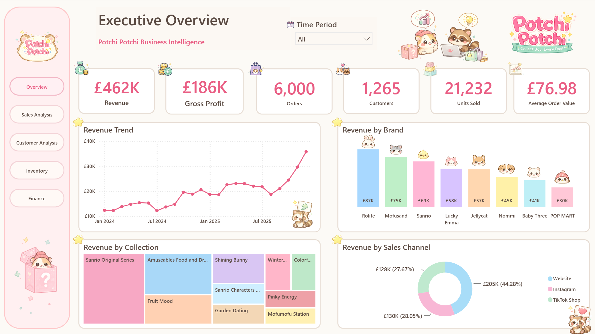
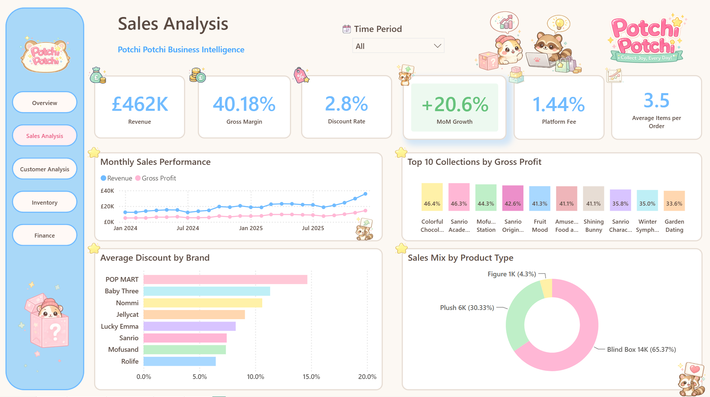
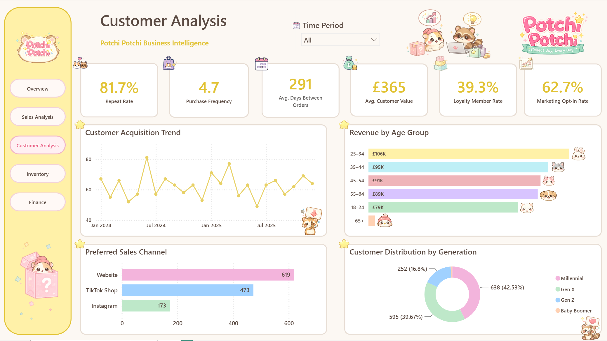
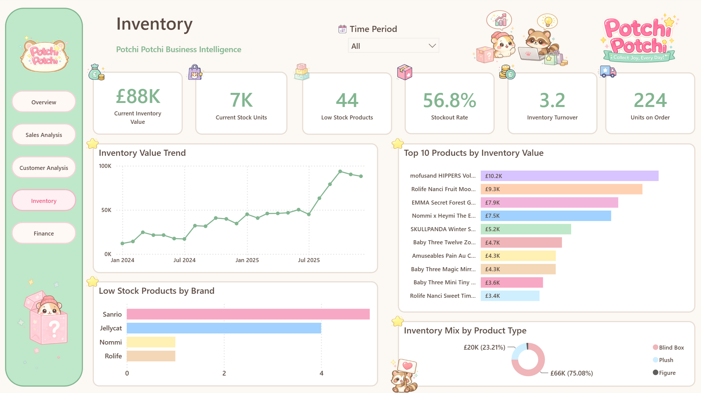
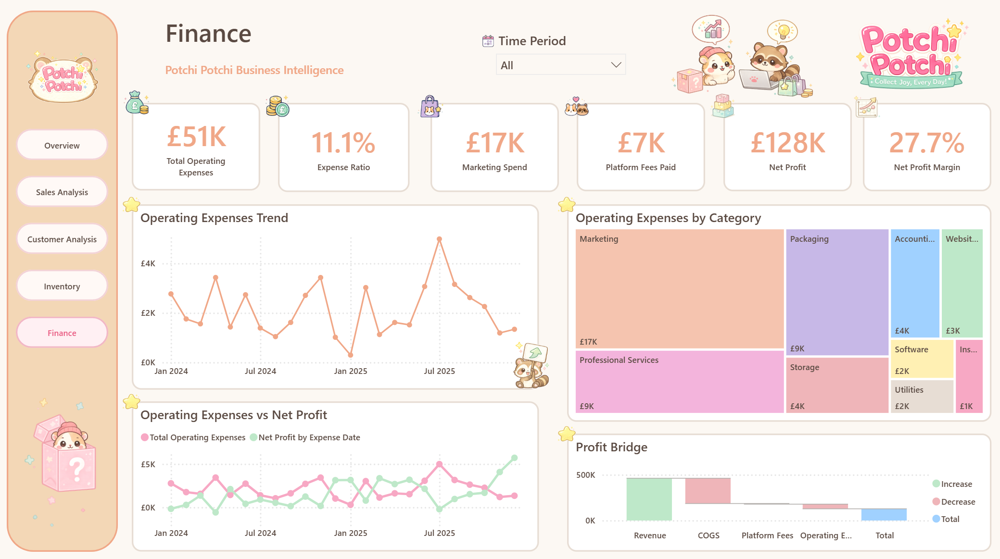

# Business Insights Report

This document summarises the insights obtained from the Power BI dashboards developed for the **Potchi Potchi Business Intelligence Project**.

> **Note**
>
> This project uses a **synthetic dataset** created exclusively for educational and portfolio purposes. The analyses presented below demonstrate Business Intelligence methodologies and data-driven decision-making rather than the performance of a real company.

---

# Executive Overview

## Business Summary

The Executive Overview dashboard provides a high-level summary of Potchi Potchi's business performance between **January 2024 and December 2025**.

During this period, the business generated:

- **Revenue:** £462K
- **Gross Profit:** £186K
- **Gross Margin:** 40.18%
- **Orders:** 6,000
- **Customers:** 1,265
- **Units Sold:** 21,232
- **Average Order Value:** £76.98

Overall, the company demonstrates steady commercial growth while maintaining healthy profitability throughout the analysed period.

---

## Key Findings

### Revenue Trend

Revenue follows a clear upward trajectory across the two-year period.

After a relatively stable first semester in 2024, sales temporarily declined during July before recovering in August. Revenue continued growing throughout 2025, reaching its highest monthly value in December.

The final quarter of 2025 presents the strongest sales performance, suggesting increased customer demand during the holiday shopping season.

---

### Revenue by Brand

Revenue is well distributed across multiple brands.

The highest revenue-generating brands are:

1. Rolife (£87K)
2. Mofusand (£75K)
3. Sanrio (£69K)
4. Lucky Emma (£58K)

POP MART generated the lowest revenue among the displayed brands.

---

### Revenue by Collection

The most profitable collections are:

- Sanrio Original Series
- Amuseables Food & Drink
- Fruit Mood
- Shining Bunny

Although Sanrio ranks as the third highest revenue-generating brand overall, its Original Series collection is the strongest-performing collection within the portfolio.

---

### Revenue by Sales Channel

Revenue is distributed across three sales channels:

- Website (£205K)
- Instagram (£130K)
- TikTok Shop (£128K)

The Website remains the company's primary revenue source, while social commerce channels collectively account for more than half of total revenue.

---

## Business Insights

- Revenue demonstrates consistent long-term growth.
- The temporary sales decline observed during July 2024 may indicate seasonal purchasing behaviour.
- Revenue growth during the last quarter of 2025 suggests increased seasonal demand.
- Rolife, Mofusand and Sanrio should remain strategic inventory priorities.
- Collection-level analysis reveals opportunities that cannot be identified through brand-level analysis alone.
- Further segmentation combining Sales Channel, Age Group and Generation could improve marketing effectiveness.

---

# Sales Analysis

## Business Summary

The Sales Analysis dashboard evaluates sales efficiency, pricing strategy and profitability.

During the analysed period, Potchi Potchi maintained:

- Revenue: £462K
- Gross Margin: 40.18%
- Discount Rate: 2.8%
- Platform Fee: 1.44%
- Average Items per Order: 3.5
- Month-over-Month Growth: +20.6%

The results indicate profitable revenue growth without relying on aggressive discounting.

---

## Key Findings

### Monthly Sales Performance

Revenue and Gross Profit increase simultaneously throughout the analysed period.

Gross Profit follows Revenue closely, suggesting that sales growth translates directly into profitability rather than being offset by increasing costs or excessive discounts.

---

### Gross Profit by Collection

Several collections achieve gross margins above 40%.

The highest-performing collections include:

- Colorful Chocolate
- Sanrio Academy
- Mofu Station
- Sanrio Original Series

These collections combine healthy profitability with strong commercial performance.

---

### Average Discount by Brand

Discount strategies vary considerably across brands.

POP MART receives the largest average discount while Rolife applies the lowest.

Despite receiving larger discounts, POP MART remains the lowest revenue-generating brand.

---

### Sales Mix

Blind Boxes account for approximately 65% of total units sold, followed by Plush products and Figures.

This confirms Blind Boxes as the company's primary product category.

---

## Business Insights

- Revenue growth is supported by healthy gross margins.
- Current pricing strategy appears sustainable.
- Larger discounts do not necessarily generate stronger commercial performance.
- Blind Boxes represent the core business category.
- Product diversification could reduce dependence on a single product segment.

---

# Customer Analysis

## Business Summary

The Customer Analysis dashboard explores acquisition, loyalty and purchasing behaviour.

Key customer metrics include:

- Repeat Rate: 81.7%
- Purchase Frequency: 4.7 orders
- Average Days Between Orders: 291
- Average Customer Value: £365
- Loyalty Member Rate: 39.3%
- Marketing Opt-In Rate: 62.7%

The results suggest strong customer retention and long-term engagement.

---

## Key Findings

### Customer Acquisition

Customer acquisition remains relatively stable throughout the analysed period.

No significant long-term decline is observed.

---

### Revenue by Age Group

Customers aged 25–34 generate the highest revenue, followed by customers aged 35–44 and 45–54.

Older customer groups contribute considerably less revenue.

---

### Preferred Sales Channel

The Website is the preferred purchasing channel.

TikTok Shop represents a surprisingly strong secondary channel, outperforming Instagram.

---

### Customer Distribution

Millennials represent the largest customer segment, closely followed by Generation X.

---

## Business Insights

- Customer loyalty represents one of the company's strongest assets.
- Millennials remain the primary target audience.
- The Website should continue receiving investment.
- Combining demographic segmentation with purchasing channels could support more personalised marketing campaigns.

---

# Inventory Analysis

## Business Summary

The Inventory dashboard evaluates stock availability and inventory health.

Current inventory metrics include:

- Inventory Value: £88K
- Current Stock Units: 7K
- Low Stock Products: 44
- Stockout Rate: 56.8%
- Inventory Turnover: 3.2
- Units on Order: 224

---

## Key Findings

### Inventory Value Trend

Inventory value increases steadily over time before stabilising near the end of 2025.

---

### Inventory Value by Product

Inventory investment is concentrated in a relatively small number of premium products.

---

### Low Stock Products

Sanrio and Jellycat account for most products currently below their reorder point.

---

### Inventory Mix

Blind Boxes represent approximately 75% of total inventory value.

---

## Business Insights

- Inventory growth appears aligned with business expansion.
- Inventory concentration increases exposure to demand fluctuations.
- High-demand brands require closer replenishment planning.
- Monitoring inventory turnover will be essential as the business expands.

---

# Financial Analysis

## Business Summary

The Finance dashboard evaluates operational efficiency and profitability.

Key financial indicators include:

- Operating Expenses: £51K
- Marketing Spend: £17K
- Platform Fees: £7K
- Net Profit: £128K
- Net Profit Margin: 27.7%

Overall, the business demonstrates strong financial performance throughout the analysed period.

---

## Key Findings

### Operating Expenses

Operating expenses fluctuate moderately without showing uncontrolled growth.

---

### Expense Breakdown

Marketing represents the largest operating expense, followed by Professional Services and Packaging.

---

### Operating Expenses vs Net Profit

Net Profit consistently exceeds Operating Expenses, demonstrating sustainable profitability.

---

### Profit Bridge

The waterfall analysis illustrates how Revenue is progressively reduced by Cost of Goods Sold, Platform Fees and Operating Expenses before reaching Net Profit.

Cost of Goods Sold represents the largest profitability reduction, which is expected in a retail environment.

---

## Business Insights

- Revenue growth continues to outpace operating costs.
- Marketing investment appears proportional to business growth.
- Platform fees currently have a limited financial impact.
- The business maintains healthy profitability despite increasing operational expenses.

---

# Executive Recommendations

Based on the dashboard analyses, the following actions are recommended:

- Continue prioritising Rolife, Mofusand and Sanrio products.
- Monitor underperforming brands such as POP MART to determine whether poor performance is related to demand, assortment or pricing.
- Expand inventory planning before seasonal demand peaks.
- Increase customer segmentation by combining Age Group, Generation and Sales Channel.
- Continue investing in Website optimisation while maintaining strong social commerce performance.
- Monitor operating expenses to preserve current profitability levels.
- Expand collection-level analyses to support future merchandising decisions.

---

# Strategic Business Assessment

The primary objective of this Business Intelligence project was to evaluate whether Potchi Potchi could become a profitable UK-based designer collectibles retailer capable of supporting future international expansion.

Based on the dashboard analyses, the business demonstrates strong operational and financial performance throughout the two-year period.

Positive indicators include:

- Consistent revenue growth across the reporting period.
- Healthy Gross Margin (40.18%) and Net Profit Margin (27.7%).
- Strong customer loyalty, with an 81.7% Repeat Rate.
- Stable operating expenses despite business growth.
- Positive inventory turnover, suggesting healthy stock movement.
- Diversified revenue across brands, collections and sales channels.

Together, these indicators suggest that the current business model is financially sustainable and capable of supporting controlled business expansion.

However, the current Business Intelligence solution does **not** provide sufficient evidence to recommend immediate expansion into Brazil.

International expansion introduces additional variables that are outside the scope of this project, including:

- Local taxation and import duties.
- International logistics and warehousing.
- Currency exchange fluctuations.
- Country-specific customer demand.
- Operational and legal requirements.

For this reason, expansion into Brazil should only be considered after dedicated market research, financial modelling and operational feasibility studies.

A more appropriate next step would be to evaluate expansion into geographically closer European markets, such as **Ireland**, followed by additional European countries, including **Portugal**, **Spain** and **France**, subject to future market validation.

This phased expansion strategy would reduce operational risk while allowing the business to scale gradually using the capital generated by its UK operations.

---

## Operational Considerations

The dashboards indicate that inventory levels continue to increase alongside business growth.

Although the current solution monitors inventory value, stock levels and inventory turnover, it does **not** model physical storage capacity.

Consequently, the dashboards cannot accurately determine the ideal moment to transition from home-based storage to an external warehouse, such as a Shurgard storage unit.

To support this decision, future versions of the model could include additional product attributes such as package dimensions or storage volume.

This enhancement would enable the creation of metrics such as:

- Storage Capacity Utilisation (%)
- Estimated Storage Volume
- Remaining Storage Capacity

These indicators would allow warehouse expansion decisions to be driven by physical storage utilisation rather than inventory value alone.

---

## Final Conclusion

The dashboards provide sufficient evidence to conclude that Potchi Potchi is a financially healthy and operationally sustainable business within the scope of the United Kingdom.

They also provide confidence that the company is capable of supporting a gradual expansion strategy into nearby European markets.

However, the available data does not yet support immediate expansion into Brazil. Additional business intelligence initiatives, market research and financial planning would be required before making that strategic decision.

In conclusion, the Business Intelligence solution successfully answers the project's primary business question while also identifying future analytical opportunities to support the company's long-term growth strategy.

Rather than providing a single "yes" or "no" answer, the dashboards offer decision-makers the evidence required to support informed, data-driven strategic planning.